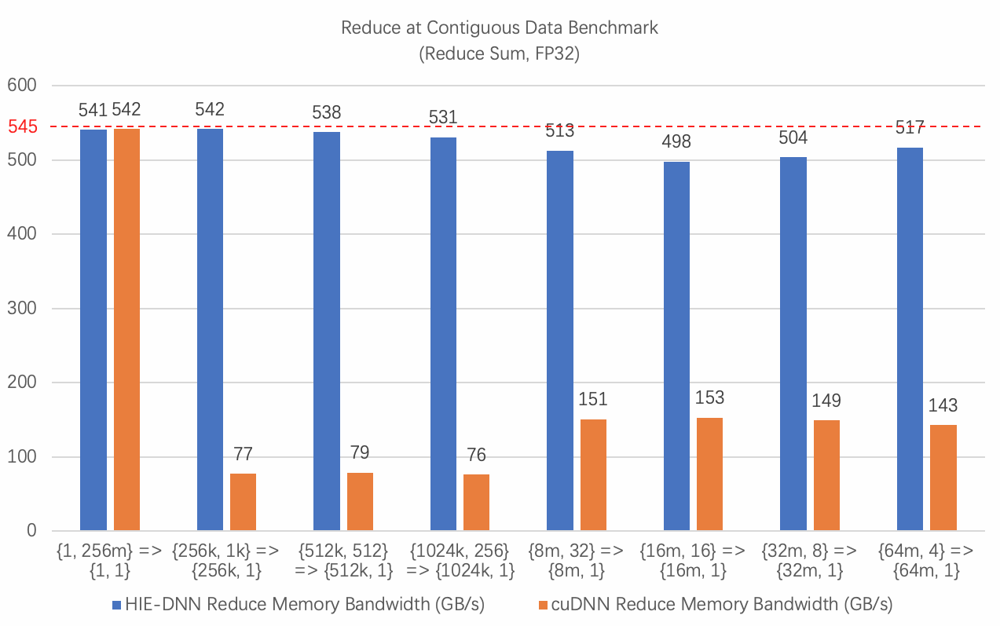
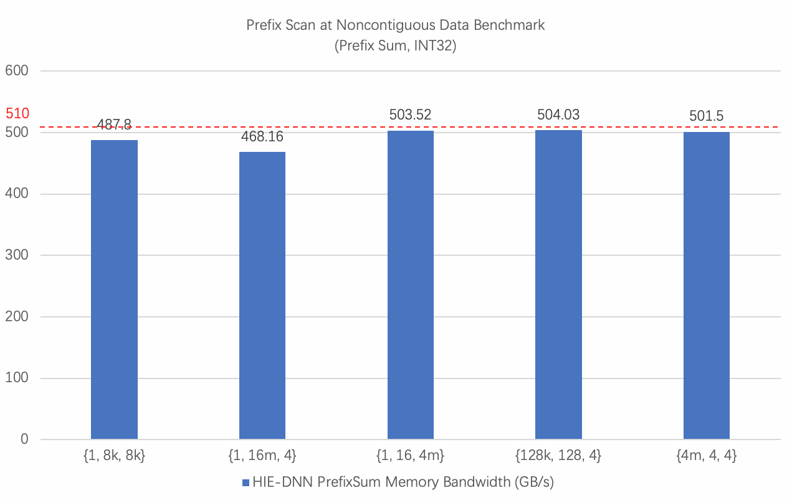
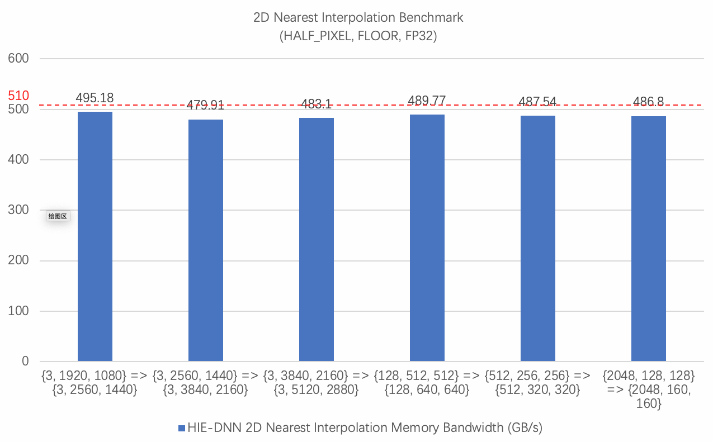
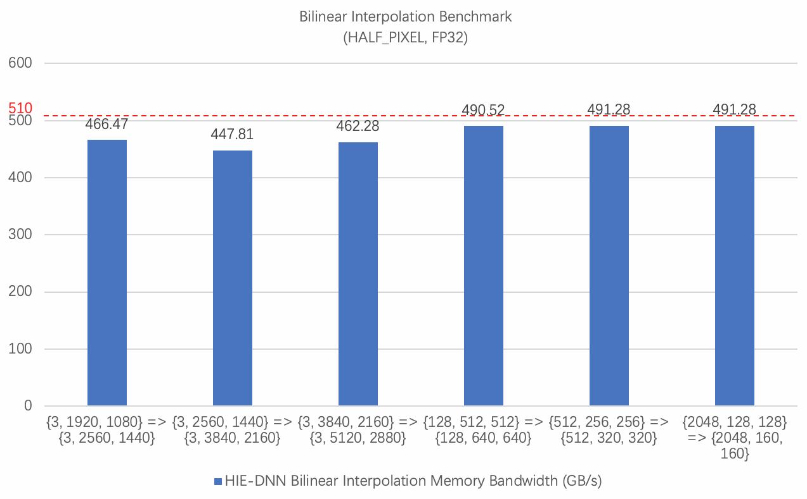
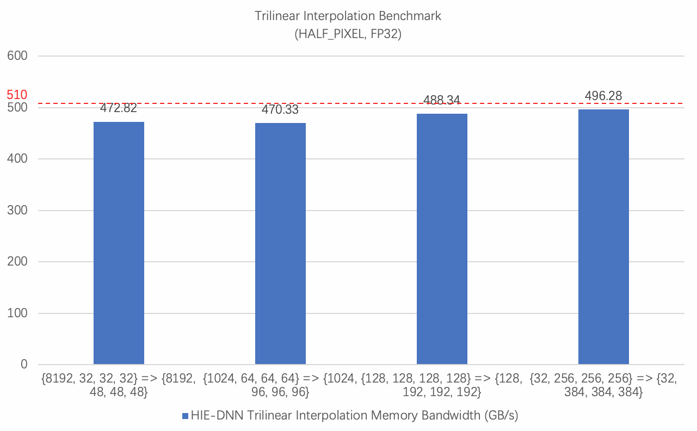

HIE-DNN
=======

HIE-DNN is an open-source operator library for high-performance inference of deep neural network (DNN). It's designed to support multiple platforms (called 'backend' in HIE-DNN), including CPP (ISO C++11 programmable devices) and CUDA.
But for now, HIE-DNN mainly focuses on the CUDA backend, and only few operators are supported in CPP backend without any optimization.

HIE-DNN was originally a component of HCI team's Inference Engine (HIE). Now it stands alone as a self-contained library supporting not only HIE but also other applications requiring high-performance operators.

This library provides common operators optimized for modern NVIDIA GPUs, mostly complying with [ONNX](https://onnx.ai/) open format.
It supports all common data types including 32-bit and 64-bit floating points (FP32 and FP64), integers, and booleans, as well as types playing special roles in deep learning inference like 8-bit integers (INT8), 16-bit floating points (FP16), and bfloat16 (BF16).

# Table of Contents

- [Table of Contents](#table-of-contents)
- [Performance](#performance)
  - [CUDA Backend](#cuda-backend)
- [Installation](#installation)
  - [Requirements for Building](#requirements-for-building)
  - [Building from Source](#building-from-source)
  - [Running Tests](#running-tests)
  - [Building Documentation](#building-documentation)
- [Usage](#usage)
  - [Examples](#examples)
  - [Using HIE-DNN in Your Own Projects](#using-hie-dnn-in-your-own-projects)
- [Project Structure](#project-structure)
  - [HIE-DNN Library](#hie-dnn-library)
  - [HIE-DNN Examples](#hie-dnn-examples)
  - [Tests](#tests)
- [License](#license)

# Performance

## CUDA Backend

**Reduction**

- Device: Geforce RTX2080Ti @7000,1635Mhz
- Driver: 510.47
- CUDA: v11.6
- cuDNN: v8.4.1

The reduction operator reduce a large tensor to a very small tensor, it's a memory bound and DRAM read heavily case.
We benchmarked the DRAM read-only bandwidth (~545GB/s for RTX2080Ti @7000,1635MHz) by a microbenchmark kernel and consider the bandwidth as the performance theoretical upper bound.

Memory bandwidth of reduction operator was calculated by `(inputTensorSize + outputTensorSize) / duration`.

We also benchmarked the performance of cuDNN reduction operator (cudnnReduceTensor API) and compare it with HIE-DNN.



Reduce at contiguous data means reduce a multi-dimensional tensor at the axis which are contiguous in memory, such as reduce a row-major matrix with shape {M, N} to shape {M, 1}.
For contiguous data, reduction operator of HIE-DNN can achieve over 90% of the performance theoretical upper bound.


Reduce at noncontiguous data means reduce a multi-dimensional tensor at the axis which are noncontiguous in memory, such as reduce a batch of row-major matrix with shape {batchSize, M, N} to shape {batchSize, 1, N}
For noncontiguous data, reduction operator of HIE-DNN can achieve over 80% of the performance theoretical upper bound.

**PrefixScan**

- Device: Geforce RTX2080Ti @7000,1635Mhz
- Driver: 510.47
- CUDA: v11.6

The PrefixScan operator load the input tensor, calculate prefix/suffix sum and store the output tensor, it's a memory bound case like memory copy.
We benchmarked the DRAM copy bandwidth (~510GB/s for RTX2080Ti @7000,1635MHz) by a microbenchmark kernel (or cudaMemcpy API) and consider the bandwidth as the performance theoretical upper bound.

HIE-DNN prefix scan is a single pass scan, so the memory bandwidth of HIE-DNN prefix scan was calculated by `(inputTensorSize + outputTensorSize) / duration`.


PrefixScan at contiguous data means scan a multi-dimensional tensor at the axis which are contiguous in memory, such as scan a row-major matrix with shape {M, N} at the N-dimension.
For contiguous data, prefix scan operator of HIE-DNN can achieve over 95% of the performance theoretical upper bound.



PrefixScan at noncontiguous data means scan a multi-dimensional tensor at the axis which are noncontiguous in memory, such as scan a batch of row-major matrix with shape {batchSize, M, N} at the M-dimension.
For noncontiguous data, prefix scan operator of HIE-DNN can achieve over 90% of the performance theoretical upper bound.

**Interpolation**

- Device: Geforce RTX2080Ti @7000,1635Mhz
- Driver: 510.47
- CUDA: v11.6

The interpolation operator load the input tensor and up or down sample to the output tensor. For the most cases, it's memory bound on GPUs with GDDR memory.
It can also be FMA or SFU instruction bound for extremely multi-dimensional cases, such as 7D linear interpolation for a 7D tensor, but it's rare in realistic scenarios.
So we benchmarked the DRAM copy bandwidth (~510GB/s for RTX2080Ti @7000,1635MHz) by a microbenchmark kernel (or cudaMemcpy API) and consider the bandwidth as the performance theoretical upper bound.

For upsampling, elements of input tensor may be loaded many times, it can be hit in L1/L2 cache, so we ignore the duplicate memory load and calculate the memory bandwidth of interpolation operator by `(inputTensorSize + outputTensorSize) / duration`.



For 2D nearest interpolation, HIE-DNN can achieve over 94% of the performance theoretical upper bound.


For 3D nearest interpolation, HIE-DNN can achieve over 89% of the performance theoretical upper bound.



For bilinaer interpolation, HIE-DNN can achieve over 88% of the performance theoretical upper bound.



For trilinear interpolation, HIE-DNN can achieve over 92% of the performance theoretical upper bound.

# Installation

## Requirements for Building

- OS: Linux, tested on Debian 11, Ubuntu 20.04, Ubuntu 22.04, CentOS 6.x, CentOS 7.x and CentOS 8
- Compiler: C++11 compiler
- CMake: CMake 3.15.0 or above

To build the document, doxygen 1.9.8 or above is also required.

For a specific backend, it also requires:

**C++ Backend:**

- Device: C++11 programmable.

**CUDA Backend:**

- CUDA: CUDA 9.0 or above. For best performance, it's recommended to build with the latest CUDA toolkit.
- Device: Kepler(sm30) or above, depending on the device supporting list of the CUDA toolkit.
- Driver: Compatible with the device and CUDA toolkit.

## Building from Source

Firstly download the source codes with Git.

```sh
$ git clone $url_to_hiednn HIE-DNN
$ cd HIE-DNN
```

Then configure the project with CMake using `build` as the build tree.

```sh
$ cmake -S . -B build
```

**NOTE**: CMake configuration of HIE-DNN supports the following options taking value in ON and OFF:

- `USE_CPP`: enable CPP backend (default: ON)
- `USE_CUDA`: enable CUDA backend (default: ON)
- `USE_FP16`: enable FP16 support (default: ON)
- `USE_BF16`: enable BF16 support (default: ON)
- `UTEST`: build unit tests (default: ON)
- `EXAMPLE`: build examples (default: ON)
- `ENABLE_DEBUG`: build in Debug mode (default: OFF)

These options can be passed to CMake like

```sh
$ cmake -D USE_FP16=ON -S . -B build
```

Next, build the library with the following command, where `` `nproc` `` can also be replaced with another maximum number of concurrent processes you want to use when building.

```sh
$ cmake --build build -j`nproc`
```

Building may take a while. Then install the library with

```sh
$ cmake --install build
```

**NOTE**: if you want to install the library to a different place other than the default directory, `--prefix` may be used. For example, the following command installs the library to `hie-dnn` in the user's home directory.

```sh
$ cmake --install build --prefix $HOME/hie-dnn
```

After finishing installation, the static library `libhiednn_static.a` and the dynamic library `libhiednn.so` can be found in `lib64` in the installation directory, and the headers can be found in `include` in the installation directory.

## Running Tests

Each operator is provided with a set of unit tests based on [GoogleTest](https://github.com/google/googletest).
By default, they are built when building the library.
Taking CUDA backend as an example, after building you can launch all tests with

```sh
$ build/bin/utest/cuda_utest
```

To run tests for a specific operator, use `--gtest_filter` option. For example, run tests for CUDA `Slice` operator:

```sh
$ build/bin/utest/cuda_utest --gtest_filter=Slice_CUDA*
```

You can also launch a specific test:

```sh
$ build/bin/utest/cuda_utest --gtest_filter=Slice_CUDA.DEFAULT_AXES
```

## Building Documentation

HIE-DNN builds its documentation with [Doxygen](https://doxygen.nl/).
The documentation can be generated with CMake at `build/doc/html` directory using the following command.

```sh
$ cmake --build build --target doc
```

# Usage

## Examples

Each operator also comes with several examples in `example` directory.
By default they are built when building the library.
For example, you can run an example of CUDA backend as below.

```sh
$ build/bin/example/02_cuda/01_unary_elementwise
```

## Using HIE-DNN in Your Own Projects

It is easy to use HIE-DNN library in your own project by simply incluing the headers and linking to the library binary.

For example, using CMake, suppose the path to your HIE-DNN installation is `HIEDNN_HOME` (e.g., `$HOME/hie-dnn` as in [Building from Source](#building-from-source) section), and the name of your target is `<target>`, then you will need to add the following settings to your `CMakeLists.txt`:

```CMake
include_directories(${HIEDNN_HOME}/include)
link_directories(${HIEDNN_HOME}/lib64)
target_link_libraries(<target> hiednn)
```

# Project Structure

HIE-DNN contains headers and implementation source files, along with examples and unit tests.
The major components are summarized below.

## HIE-DNN Library

```text
include/            # target this directory in user's building include paths
  hiednn_cpp.h      # header for standard C++ backend (limited support)
  hiednn_cuda.h     # header for CUDA Backend
  hiednn.h          # header for basic common APIs

dnn/                # HIE-DNN source files, grouped by backend
  cpp/              # source files for standard C++ backend
  cuda/             # source files for CUDA Backend
    interpolation/  # CUDA codes specialized for interpolation
    prefix_scan/    # CUDA codes specialized for prefix scan
    reduce/         # CUDA codes specialized for reduction
    *               # other core operators for CUDA backend
  include/          # internal headers used by source files
  *                 # tensor definitions
```

## HIE-DNN Examples

For each operator, HIE-DNN provides one file containing several example use cases for it.

```text
example/            # HIE-DNN Examples
  01_cpp/           # examples for C++ backend 
  02_cuda/          # examples for CUDA backend
```

## Tests

Complete unit tests of each operator in HIE-DNN is implemented with [GoogleTest](https://github.com/google/googletest).

```text
test/                   # HIE-DNN unit tests
  cpp/                  # unit tests for C++ backend
  cuda/                 # unit tests for CUDA backend
  datatype_extension/   # unit tests for FP16 and BF16 data types
  include/              # internal headers used by tests
```

# License

The HIE-DNN source code is licensed under the Apache 2.0 license, and you can find the full text of the license in the root of the repository.
