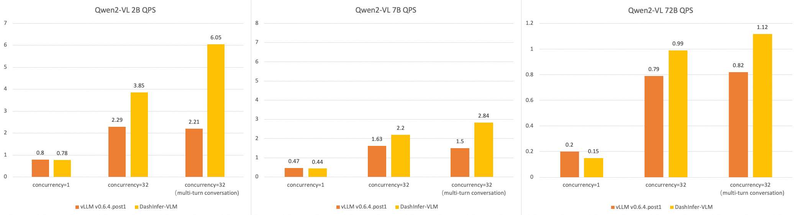
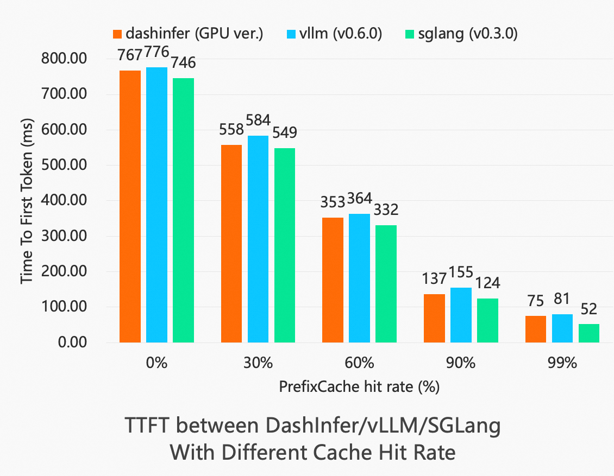
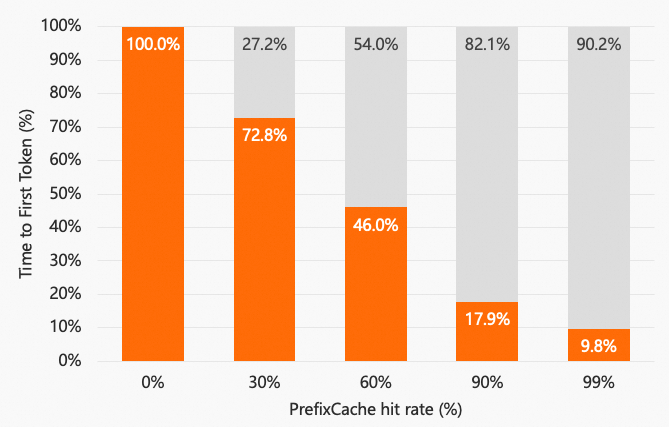
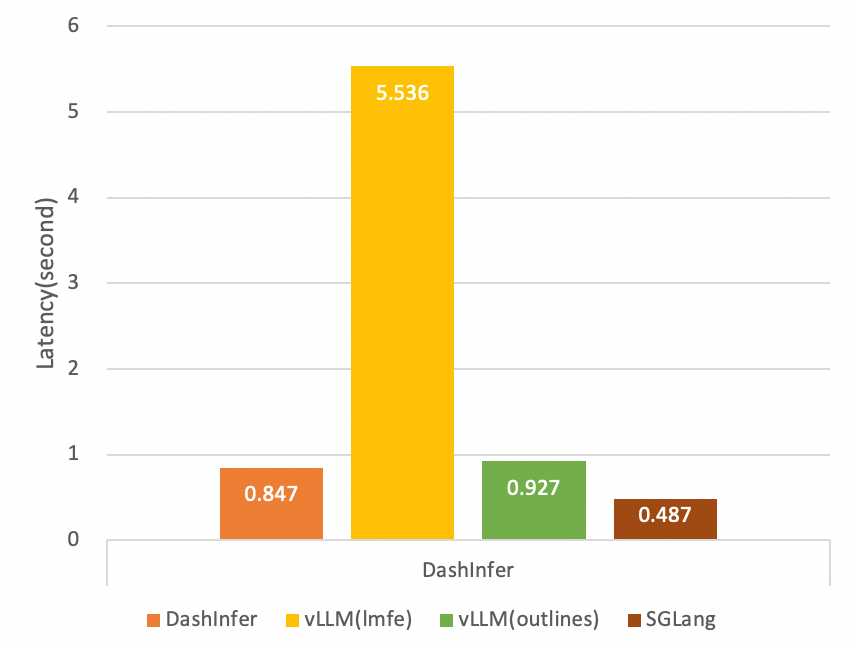

<div align="center">

[](https://pypi.org/project/dashinfer/)
[](https://dashinfer.readthedocs.io/en/latest/)

<h4 align="center">
    <p>
        <a href="https://github.com/modelscope/dash-infer/blob/main/README.md">English</a> |
        <b>中文</b>
    </p>
</h4>


</div>

# 简介

DashInfer采用C++ Runtime 编写，提供C++ 和 Python语言接口。 DashInfer 具有生产级别的高性能表现， 支持多种CUDA架构， CPU架构。 DashInfer支持多种主流LLM推理技术连续批处理（Continuous Batching），权重量化， KV-Cache量化， Page Attention（自研SpanAttention Kernel），Guided Output， Prefix Caching。

## DashInfer的主要特征

## 主要特性
DashInfer 是一个高度优化的 LLM 推理引擎，具有以下核心特性：
- **轻量级架构**: DashInfer 需要最少的第三方依赖，并使用静态链接几乎所有的依赖库。通过提供 C++ 和 Python 接口，DashInfer 可以轻松集成到您现有的系统中。
- **高精度**: DashInfer 经过严格测试以确保准确性，能够提供与 PyTorch 和其他 GPU 引擎（例如 vLLM）一致的推理精度。
- **高性能**: DashInfer 采用优化的内核提供高性能 LLM 服务，同时支持许多标准 LLM 推理技术，包括：
  - **连续批处理**: DashInfer 允许即时插入新请求，并支持流式输出。
  - **分页注意力机制**: 使用我们自研的分页注意力机制（我们称之为 *SpanAttention*），结合基于高效 GEMM 和 GEMV 实现的 int8 和 uint4 KV 缓存量化，能够实现注意力运算符的高效加速。
  - **前缀缓存**: DashInfer 支持高效的前缀缓存，用于加速标准 LLMs 和多模态 LMs（如 Qwen-VL），支持 GPU 和 CPU。
  - **量化支持**: 使用 DashInfer 的 *InstantQuant*（IQ），无需微调即可实现权重量化加速，提高部署效率。准确率评估显示，IQ 几乎不影响模型准确率，详细信息请参见：:doc:`quant/weight_activate_quant`。
  - **异步接口**: 基于请求的异步接口提供对每个请求生成参数和请求状态的独立控制。
- 支持的模型：
  - **主流开源 LLMs**: DashInfer 支持主流开源 LLMs，包括 Qwen、LLaMA、ChatGLM 等，且支持加载 Huggingface 格式的模型。
  - **多模态大模型(VLMs)**: DashInfer 支持多模态语言模型（VLMs），包括 Qwen-VL、Qwen-AL 和 Qwen2-VL。
- **OpenAI API 服务器**: DashInfer 可以轻松与 fastChat 配合使用，实现兼容 OpenAI 的 API 服务器。
- **多编程语言 API**: 提供 C++ 和 Python 接口。通过标准的跨语言接口，可以将 C++ 接口扩展到 Java、Rust 等编程语言。


# 硬件支持和数据类型

## 硬件支持
- **CUDA GPU**：支持 CUDA 版本从 11.4 到 12.4，并支持多种 CUDA 计算架构，例如 SM70 - SM90a（T4、3090、4090、V100、A100、A10、L20、H20、H100）
- **x86 CPU**：要求硬件至少需要支持AVX2指令集。对于第五代至强（Xeon）处理器（Emerald Rapids）、第四代至强（Xeon）处理器（Sapphire Rapids）等（对应于阿里云第8代ECS实例，如g8i），采用AMX矩阵指令加速计算。
- **ARMv9 CPU**：要求硬件支持SVE指令集。支持如倚天（Yitian）710等ARMv9架构处理器（对应于阿里云第8代ECS实例，如g8y），采用SVE向量指令加速计算。

## 数据类型
- **CUDA GPUs**: FP16, BF16, FP32, Int8(InstantQuant), Int4(InstantQuant)
- **x86 CPU**：支持FP32、BF16。
- **ARM Yitian710 CPU**：FP32、BF16、InstantQuant。

### InstantQuant
DashInfer 为 LLM 权重提供了多种量化技术，例如 int{8,4} 仅权重量化、int8 激活量化，还有许多定制的融合内核，以在指定设备上提供最佳性能。简而言之，使用 GPTQ 微调的模型将提供更好的准确性，而我们无需微调的 InstantQuant (IQ) 技术可提供更快的部署体验。IQ 量化的详细解释可以在本文末尾找到。

在支持的量化算法方面，AllSpark 通过两种方式支持使用 GPTQ 微调的模型和使用 IQ 量化技术的动态量化：
- **InstantQuant (IQ)**: DashInfer 提供了 InstantQuant (IQ) 动态量化技术，无需微调即可提供更快的部署体验。IQ 量化的详细解释可以在本文末尾找到。
- **GPTQ**: 使用 GPTQ 微调的模型将提供更好的准确性，但它需要一个微调步骤。

这里介绍的量化策略大致可以分为两类：
- **仅权重量化**: 这种量化技术仅对权重进行量化和压缩，例如以 int8 格式存储权重，但在计算时仍旧使用 bf16/fp16。它只是减少了内存访问需求，相比 BF16 并没有提高计算性能。
- **激活量化**: 这种量化技术不仅以 int8 格式存储权重，还在计算阶段执行低精度量化计算（如 int8）。由于 Nvidia GPU 只有 int8 Tensor Core 容易保持精度，这种量化技术既能减少内存访问需求，又能提高计算性能，使其成为理想的量化方法。在准确性方面，它相比仅权重量化可能会有轻微下降，因此需要业务数据的准确性测试。

在量化粒度方面，有两种类型：
- **每通道量化**: DashInfer 的量化技术至少采用了每通道（也称为每 Token）量化粒度，有些还提供了子通道量化粒度。一般而言，每通道量化由于实现简单且性能最佳，通常能满足大多数准确性需求。只有当每通道量化的准确性不足时，才应考虑子通道量化策略。
- **子通道量化**: 与每通道量化相比，子通道量化是指将一个通道划分为 N 组，并在每组内计算量化参数。这种量化粒度通常能提供更好的准确性，但由于实现复杂度增加，带来了许多限制。例如，性能可能比每通道量化稍慢，并且由于计算公式限制，激活量化难以实现子通道量化（DashInfer的激活量化都是每通道量化）。

# 依赖
1. Python： DashInfer python package， 目前只依赖pytorch和huggingface(做safetensor模型权重加载），但是由于运行时转换得调用HF接口进行模型权重加载，所以各个模型可能有自己的依赖。
2. C++: 目前C++ Package全部静态编译了第三方依赖库，并且做了符号隐藏，所以目前C++ Package 无任何第三方库的运行时依赖。


# 文档和示例代码

## 文档

详细的用户手册请参考文档： [文档地址](https://dashinfer.readthedocs.io/en/latest/)。

### Quick Start:

1. API使用 [Python Quick Start](https://dashinfer.readthedocs.io/en/latest/get_started/quick_start_api_py_en.html)
2. LLM OpenAI Server [Quick Start Guide for OpenAI API Server](https://dashinfer.readthedocs.io/en/latest/get_started/quick_start_api_server_en.html)
3. VLM OpenAI Server [VLM Support)(https://dashinfer.readthedocs.io/en/latest/vlm/vlm_offline_inference_en.html)

### Feature介绍：

1. [Prefix Cache](https://dashinfer.readthedocs.io/en/latest/llm/prefix_caching.html)
2. [Guided Decoding](https://dashinfer.readthedocs.io/en/latest/llm/guided_decoding.html)
3. [Engine Config](https://dashinfer.readthedocs.io/en/latest/llm/runtime_config.html)

### 开发相关：

1. [Development Guide](https://dashinfer.readthedocs.io/en/latest/devel/source_code_build_en.html#)
2. [Build From Source](https://dashinfer.readthedocs.io/en/latest/devel/source_code_build_en.html#build-from-source-code)
3. [OP Profling](https://dashinfer.readthedocs.io/en/latest/devel/source_code_build_en.html#profiling)
4. [Environment Variable](https://dashinfer.readthedocs.io/en/latest/get_started/env_var_options_en.html)
 
##  代码示例

在`<path_to_dashinfer>/examples`下提供了C++、python接口的调用示例，请参考`<path_to_dashinfer>/documents/CN`目录下的文档运行示例。

- [所有Python示例文档](docs/CN/examples_python.md)
- [C++示例文档](docs/CN/examples_cpp.md)
- [Python Benchmark](https://github.com/modelscope/dash-infer/tree/main/examples/benchmark)

## 多模态模型支持

[multimodal](multimodal/) 目录下是基于DashInfer实现的多模态模型推理工具，兼容OpenAI Chat Completion API，支持文字、图片、视频输入。

# 性能

我们进行了一系列基准测试，以比较主流 LLM 推理引擎的性能。

### 多模态模型 (VLMs)

我们比较了不同规模模型下 Qwen-VL 与 vllm 的性能：



基准测试使用了 A100-80Gx1 测试 2B 和 7B 模型，使用 A100-80Gx4 测试 72B 模型。更多详情，请参考[基准文档](https://github.com/modelscope/dash-infer/blob/main/multimodal/tests/README.md)。

## Prefix Cache

我们评估了在不同缓存命中率下前缀缓存的性能：



上图显示了 DashInfer 中 TTFT（首次生成 Token 的时间）随着不同 PrefixCache 命中率的减少情况。



**测试设置：**  
- **模型：** Qwen2-72B-Instruct  
- **GPU：** 4x A100  
- **运行次数：** 20  
- **批处理大小：** 1  
- **输入 Tokens：** 4000  
- **输出 Tokens：** 1  

## Guided Decode

我们在相同请求下使用自定义 JSON 架构（A100x1 7B Qwen, 上下文长度：45，生成长度：63），比较了不同引擎的Guided Decode的性能，图中数据为整体RT ：



# 子项目

1. [HIE-DNN](https://github.com/modelscope/dash-infer/tree/main/HIE-DNN) 为 DashInfer 所使用的算子库。
2. [SpanAttention](https://github.com/modelscope/dash-infer/tree/main/span-attention) 为 DashInfer GPU 实现的分页 attention 算子。

# 引用

DashInfer 的高性能 MoE 算子基于 [这篇论文](https://arxiv.org/abs/2501.16103) 实现，此外，DashInfer 使用了高效的 top-k 算子 [*RadiK*](https://arxiv.org/abs/2501.14336).
如果我们的工作对您有帮助，欢迎引用：

```bibtex
@misc{dashinfermoe2025,
  title = {Static Batching of Irregular Workloads on GPUs: Framework and Application to Efficient MoE Model Inference}, 
  author = {Yinghan Li and Yifei Li and Jiejing Zhang and Bujiao Chen and Xiaotong Chen and Lian Duan and Yejun Jin and Zheng Li and Xuanyu Liu and Haoyu Wang and Wente Wang and Yajie Wang and Jiacheng Yang and Peiyang Zhang and Laiwen Zheng and Wenyuan Yu},
  year = {2025},
  eprint = {2501.16103},
  archivePrefix = {arXiv},
  primaryClass = {cs.DC},
  url = {https://arxiv.org/abs/2501.16103}
}

@inproceedings{radik2024,
  title = {RadiK: Scalable and Optimized GPU-Parallel Radix Top-K Selection},
  author = {Li, Yifei and Zhou, Bole and Zhang, Jiejing and Wei, Xuechao and Li, Yinghan and Chen, Yingda},
  booktitle = {Proceedings of the 38th ACM International Conference on Supercomputing},
  year = {2024}
}
```

# License

DashInfer源代码采用Apache 2.0协议授权，您可在该仓库根目录找到协议全文。
