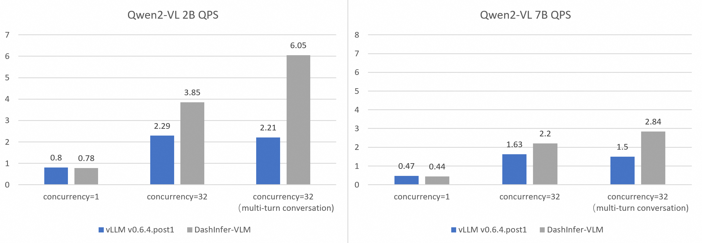
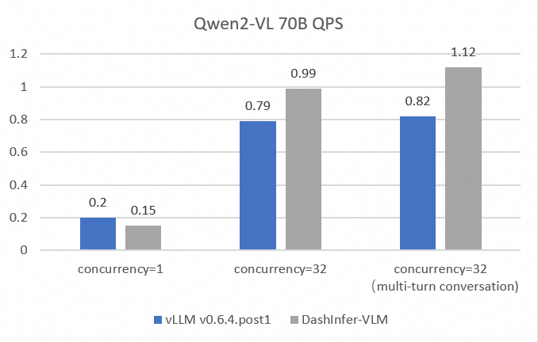

===========
VLM Support
===========

.. Qwen VL/AL Model Inference Examples
.. -----------------------------------

Before reading this document, please first read  :doc:`LLM Offline Inference By Python API <../llm/llm_offline_inference_en>` for basic concept and process.

Qwen VL Archtecture
-------------------------
The major difference between VL model and LLM can be depicted from this diagram.
From the following model archtecutre of Qwen2-VL, the image embdding will be generate by a Vision Encoder.
The text embedding will be generated by the word embedding in LLM,
and two embeddings will merged after word embedding layer based on the picture's position (indentified by the image placeholder token's position).

.. image:: https://qianwen-res.oss-cn-beijing.aliyuncs.com/Qwen2-VL/qwen2_vl.jpg
   :alt: qwen vl arch
   :align: center
   :width: 50%

DashInfer provides full support for efficient VL model serving by:

1. Separate the Vision Encoder and LLM, and they can run concurrently or on different machines.
2. Provide a interface for Vision Encoder data, with highly optmized code to overwrite the embedding in correct place in LLM.

We compared the latency and throughput of vLLM and DashInfer-VLM in independent text generation requests and requests with multi-turn conversations. The results show that Qwen2-VL 2B/7B in DashInfer-VLM achieves 1.89x/2.73x higher qps than the vLLM framework.

Deploying with Docker
-------------------------
With dashinfer-vlm docker image ``dashinfer/dashinfer_vlm_cuda_124_py310``, you can run OpenAI compatible server as follows.

.. code-block:: bash

   $ export ms_model=qwen/Qwen2-VL-2B-Instruct
   $ docker run --gpus all --shm-size 1g --name dashinfer_vlm_serve -d -p 8000:8000 dashinfer/dashinfer_vlm_cuda_124_py310:latest --model ${ms_model} --host 0.0.0.0

**Note:** You can control --min-pixels and --max-pixels to limit the image size received by the model when launching the server.

The model download from ModelScope and engine initialization may take several minutes. To check the progress, view the logs with `docker logs dashinfer_vlm_serve`. If you see:

.. code-block:: bash

   INFO:     Started server process [26]
   INFO:     Waiting for application startup.
   INFO:     Application startup complete.
   INFO:     Uvicorn running on http://0.0.0.0:8000 (Press CTRL+C to quit)

it means the VLM server is ready. You can now make a request using the OpenAI API via ``curl``. For example:

.. code-block:: bash

   curl http://localhost:8000/v1/chat/completions \
   -H "Content-Type: application/json" \
   -d \
   '{"model": "qwen/Qwen2-VL-2B-Instruct", "messages": [{"role": "user", "content": [{ "type": "text", "text": "Describe the image." }, {"type": "image_url", "image_url": {"url": "https://farm4.staticflickr.com/3075/3168662394_7d7103de7d_z_d.jpg"}}]}], "max_completion_tokens": 1024, "top_p": 0.5, "temperature": 0.1, "frequency_penalty": 1.05 }'

You can also use OpenAI's Python client library:

.. code-block:: python

   from openai import OpenAI
   client = OpenAI(
      base_url="http://localhost:8000/v1",
      api_key="EMPTY"
   )

   response = client.chat.completions.create(
      model="model",
      messages=[{
         "role": "user",
         "content": [
               {"type": "text", "text": "Are these images different?"},
               {
                  "type": "image_url",
                  "image_url": {
                     "url": "https://farm4.staticflickr.com/3075/3168662394_7d7103de7d_z_d.jpg",
                  }
               },
               {
                  "type": "image_url",
                  "image_url": {
                     "url": "https://farm2.staticflickr.com/1533/26541536141_41abe98db3_z_d.jpg",
                  }
               },
         ],
      }],
      stream=False,
      max_completion_tokens=1024,
      temperature=0.1,
   )

Launching with CLI
-------------------------
You can also opt to install dashinfer-vlm locally and use command line to launch server.

1. Pull dashinfer docker image (see :ref:`docker-label`)
2. Install TensorRT Python package, and download TensorRT GA build from NVIDIA Developer Zone.

Example: TensorRT 10.6.0.26 for CUDA 12.6, Linux x86_64

.. code-block:: bash

   pip install tensorrt
   wget https://developer.nvidia.com/downloads/compute/machine-learning/tensorrt/10.6.0/tars/TensorRT-10.6.0.26.Linux.x86_64-gnu.cuda-12.6.tar.gz
   tar -xvzf TensorRT-10.6.0.26.Linux.x86_64-gnu.cuda-12.6.tar.gz
   export LD_LIBRARY_PATH=`pwd`/TensorRT-10.6.0.26/lib

3. Install dashinfer Python Package from `release <https://github.com/modelscope/dash-infer/releases>`_
4. Install dashinfer-vlm: ``pip install dashinfer-vlm``.

Now you can launch server with command line:

.. code-block:: bash

   dashinfer_vlm_serve --model qwen/Qwen2-VL-2B-Instruct

To see all options to serve your models in the cli:

.. code-block:: bash

   dashinfer_vlm_serve -h

DashInfer API Usage
-------------------------

For multi-modal request, like video, audio, image request, user needs to create a ``MultiMediaInfo`` class to provide information for
engine handling those requests.

There are some difference between text request and mm request in content and invocation sequence:

1. Create multimedia information, specify the type and mm contnet in list of DLPack tensor.
2. Update it to generation config builder
3. You can only use ``start_request_ids`` interface because the special placehold id may not be supported by tokenizer.

MultiMediaInfo
==============

The `MultiMediaInfo` class is used to provide multimedia information for certain use cases in generation tasks. It allows you to set the multimedia type and add multimedia content, such as embeddings or other data relevant to the generation process.

.. this seem deprecated...

.. Usage
.. =====

.. To use the `MultiMediaInfo` class, you need to create an instance and set the multimedia type using the `set_multimedia_type` method. Then, you can add multimedia content using the `add_multimedia_content` method.

Example
=======

Here's an example of how to use the `MultiMediaInfo` class:

.. code-block:: python

    import torch
    import os
    import allspark

    # Load multimedia content (e.g., embeddings)
    model_path = "path/to/model"

    # image embedding just for example.
    m1 = torch.load(os.path.join(model_path, "emb.pt")).cpu().float()
    dl_list = []
    dl_list.append(torch.utils.dlpack.to_dlpack(m1))

    # Create a MultiMediaInfo instance
    as_extra_embedding_info_0 = allspark.MultiMediaInfo()

    # Add the multimedia content
    as_extra_embedding_info_0.add_multimedia_content("151859", dl_list)

    # Include the MultiMediaInfo instance in the generation config

    gen_cfg_builder = ASGenerationConfigBuilder()
    config = (gen_cfg_builder.do_sample()
          .max_length(512)
          .temperature(0.7)
          .top_k(50)
          .update({"mm_info": as_extra_embedding_info_0})
          .build())

In this example, we first load the multimedia content (embeddings in this case) from a file. We then create a `MultiMediaInfo` instance, and add the multimedia content using the `add_multimedia_content` method. Finally, we add the mm info into generation config, the following step will be same as text requests.

Methods
=======

.. py:class:: MultiMediaInfo

   .. py:method:: add_multimedia_content(identifier: str, content: List[capsule]) -> AsStatus

      Adds multimedia content to the current instance.

      :param str identifier: An identifier for the multimedia content, the id should same as the placeholder id in id inputs.
      :param List[capsule] content: A list of capsules (e.g., DLPack tensors) representing the multimedia content.
      :returns: An `AsStatus` object indicating the status of the operation.

The `MultiMediaInfo` class provides two methods:

- `set_multimedia_type`: Sets the multimedia type for the current instance (deprecated)
- `add_multimedia_content`: Adds multimedia content to the current instance, identified by a string identifier and a list of capsules (e.g., DLPack tensors) representing the content.

Both methods return an `AsStatus` object indicating the status of the operation.
