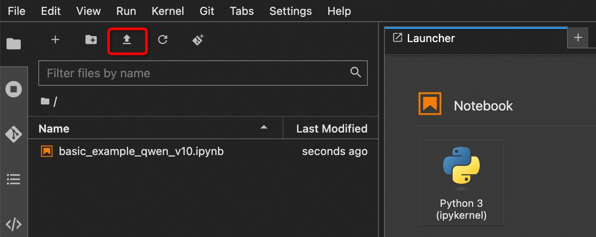
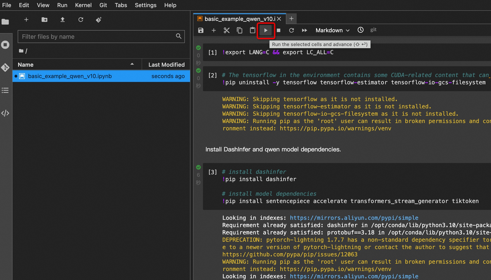

# 使用魔搭notebook部署

1. modelscope个人主页进入我的Notebook，启动一个CPU实例

{width="800px"}

2. 点击“查看Notebook”，进入创建的实例

{width="800px"}

3. 进入实例需要绑定一下阿里云账号

{width="800px"}

4. 上传basic_example_qwen_v10.ipynb

[basic_example_qwen_v10.ipynb](../../examples/python/0_basic)

{width="800px"}

5. 单步运行basic_example_qwen_v10.ipynb

{width="800px"}

