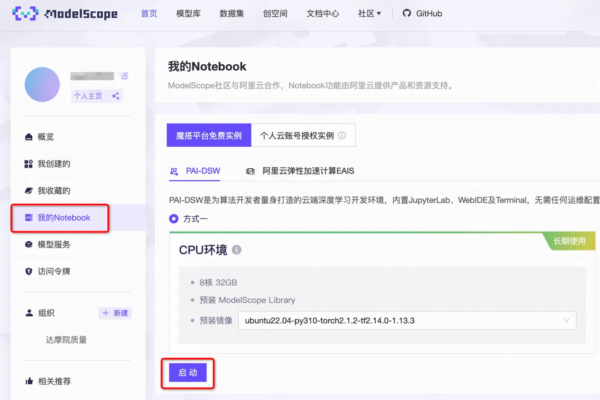
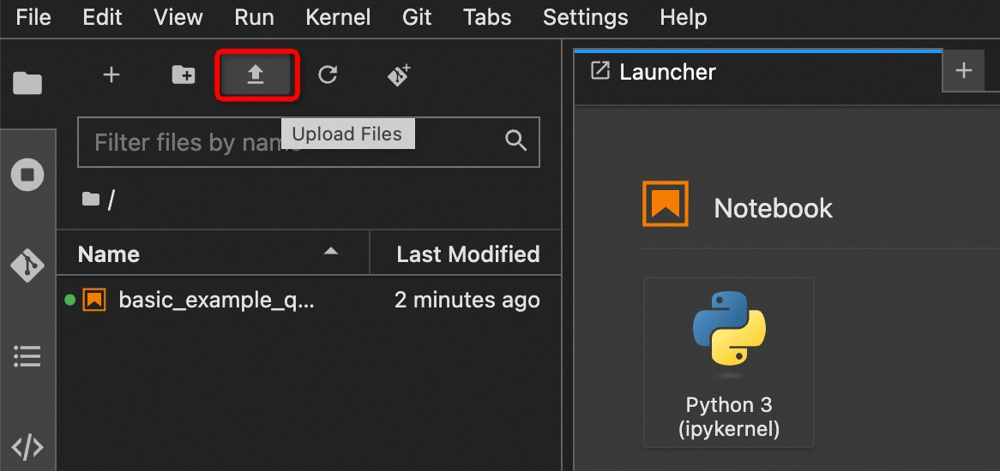
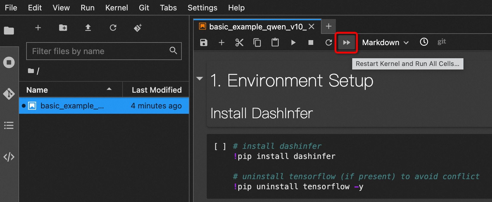

# 使用魔搭notebook部署

1. modelscope个人主页进入我的Notebook，启动一个CPU实例

注意要选择与图示相同的预装镜像。

{width="800px"}

2. 点击“查看Notebook”，进入创建的实例

进入实例需要按照界面提示绑定一下阿里云账号。

{width="800px"}

3. 上传basic_example_qwen_v10_io.ipynb

[basic_example_qwen_v10_io.ipynb](../../examples/python/0_basic/basic_example_qwen_v10_io.ipynb)

{width="800px"}

4. 单步运行basic_example_qwen_v10_io.ipynb

{width="800px"}

