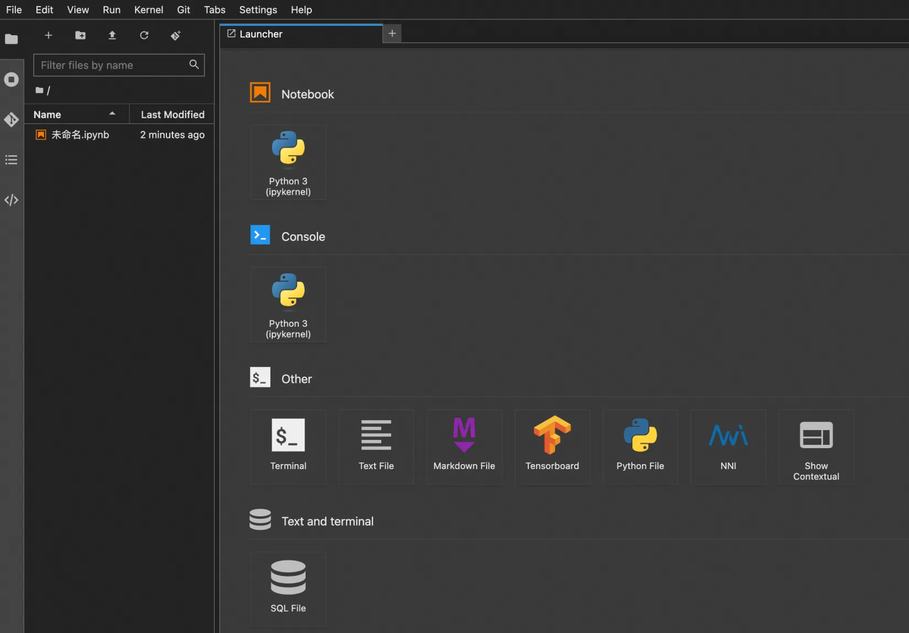
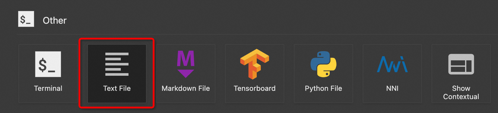
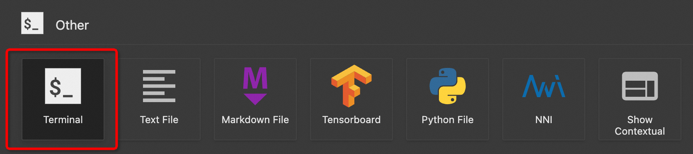
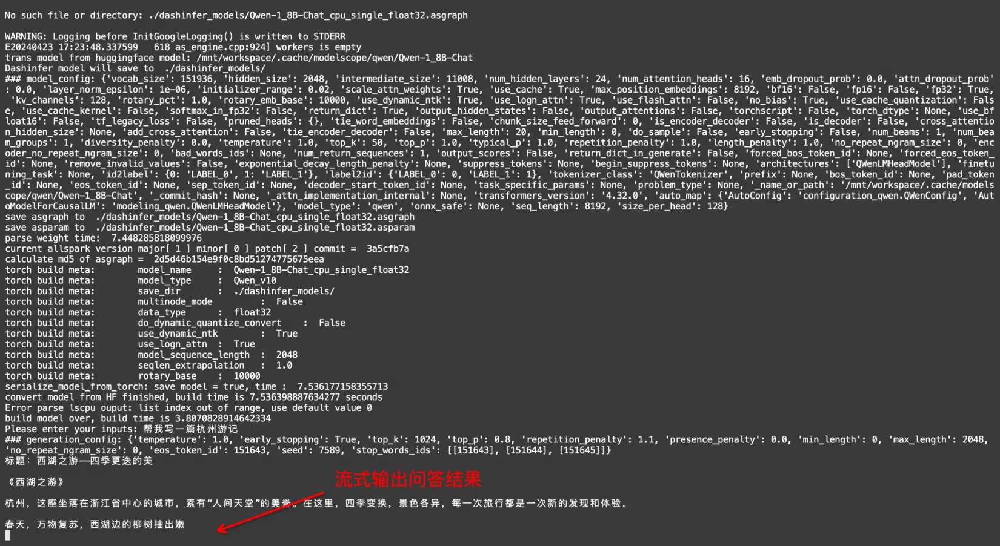
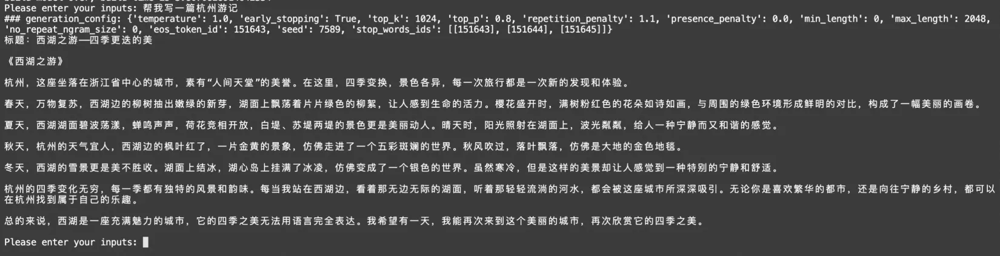

# 使用魔搭notebook部署

1. modelscope个人主页进入我的Notebook，启动一个CPU实例

{width="800px"}


2. 点击“查看Notebook”，进入创建的实例

{width="800px"}


3. 进入实例需要绑定一下阿里云账号

{width="800px"}


4. 进入后看到如图所示界面

{width="800px"}


5. 新建文件

{width="800px"}

需要创建的文件名为：

- requirements.txt
- basic_example_qwen_v10_io.py
- config_qwen_v10_1_8b.json

文件内容为：

- requirements.txt

```python
# demo requirements
modelscope

# model requirements
sentencepiece
accelerate
transformers_stream_generator
tiktoken
```

- basic_example_qwen_v10_io.py

```python
#
# Copyright (c) Alibaba, Inc. and its affiliates.
# @file    basic_example_qwen_v10_io.py
#
import os
import sys
import copy
import time
import queue
import random
import subprocess
from concurrent.futures import ThreadPoolExecutor

os.environ['GLOG_minloglevel'] = '2' # disable LOG(INFO) logging
from dashinfer.helper import EngineHelper


def download_model(model_id, revision, source="modelscope"):
    print(f"Downloading model {model_id} (revision: {revision}) from {source}")
    if source == "modelscope":
        from modelscope import snapshot_download
        model_dir = snapshot_download(model_id, revision=revision)
    elif source == "huggingface":
        from huggingface_hub import snapshot_download
        model_dir = snapshot_download(repo_id=model_id)
    else:
        raise ValueError("Unknown source")

    print(f"Save model to path {model_dir}")

    return model_dir


def create_test_prompt(inputs, default_gen_cfg=None):
    gen_cfg_list = []
    prompt = copy.deepcopy(inputs)
    prompt = "<|im_start|>system\nYou are a helpful assistant.<|im_end|>\n<|im_start|>user\n" \
                     + prompt + "<|im_end|>\n<|im_start|>assistant\n"
    if default_gen_cfg != None:
        gen_cfg = copy.deepcopy(default_gen_cfg)
        gen_cfg["seed"] = random.randint(0, 10000)
        gen_cfg_list.append(gen_cfg)

    return [prompt], gen_cfg_list

def print_in_place(generator):
    need_init_cursor_pos = True

    for part in generator:
        if need_init_cursor_pos:
            print('\x1b[s', end='') # save cursor position (SCO)
            need_init_cursor_pos = False

        print('\x1b[u', end='') # restores the cursor to the last saved position (SCO)
        print(part)
    print()


if __name__ == '__main__':
    config_file = "./config_qwen_v10_1_8b.json"
    config = EngineHelper.get_config_from_json(config_file)

    cmd = f"pip show dashinfer | grep 'Location' | cut -d ' ' -f 2"
    package_location = subprocess.run(cmd,
                                      stdout=subprocess.PIPE,
                                      stderr=subprocess.PIPE,
                                      shell=True,
                                      text=True)
    package_location = package_location.stdout.strip()
    os.environ["AS_DAEMON_PATH"] = package_location + "/dashinfer/allspark/bin"
    os.environ["AS_NUMA_NUM"] = str(len(config["device_ids"]))
    os.environ["AS_NUMA_OFFSET"] = str(config["device_ids"][0])

    ## download original model
    ## download model from huggingface
    # original_model = {
    #     "source": "huggingface",
    #     "model_id": "Qwen/Qwen-1_8B-Chat",
    #     "revision": "",
    #     "model_path": ""
    # }

    ## download model from modelscope
    original_model = {
        "source": "modelscope",
        "model_id": "qwen/Qwen-1_8B-Chat",
        "revision": "v1.0.0",
        "model_path": ""
    }
    original_model["model_path"] = download_model(original_model["model_id"],
                                                  original_model["revision"],
                                                  original_model["source"])

    ## init EngineHelper class
    engine_helper = EngineHelper(config)
    engine_helper.verbose = True
    engine_helper.init_tokenizer(original_model["model_path"])
    engine_helper.init_torch_model(original_model["model_path"])

    ## convert huggingface model to dashinfer model
    ## only one conversion is required
    if engine_helper.check_model_exist() == False:
        engine_helper.convert_model(original_model["model_path"])

    ## inference
    engine_helper.init_engine()

    try:
        while True:
            input_value = input("Please enter your inputs: ")
            if input_value.lower() == 'exit':
                print("Exiting program.")
                break

            prompt_list, gen_cfg_list = create_test_prompt(
                input_value, engine_helper.default_gen_cfg)
            request_list = engine_helper.create_request(prompt_list, gen_cfg_list)
            request = request_list[0]

            gen = engine_helper.process_one_request_stream(request)
            print_in_place(gen)
    
    except KeyboardInterrupt:
        sys.stdout.write("\nProgram interrupted. Exiting...\n")
        sys.exit()

    engine_helper.uninit_engine()
```

- config_qwen_v10_1_8b.json

```json
{
  "model_name": "Qwen-1_8B-Chat",
  "model_type": "Qwen_v10",
  "model_path": "./dashinfer_models/",
  "data_type": "float32",
  "device_type": "CPU",
  "device_ids": [
    0
  ],
  "multinode_mode": false,
  "convert_config": {
    "do_dynamic_quantize_convert": false
  },
  "engine_config": {
    "engine_max_length": 2048,
    "engine_max_batch": 8,
    "do_profiling": false,
    "num_threads": 0,
    "matmul_precision": "medium"
  },
  "generation_config": {
    "temperature": 1.0,
    "early_stopping": true,
    "top_k": 1024,
    "top_p": 0.8,
    "repetition_penalty": 1.1,
    "presence_penalty": 0.0,
    "min_length": 0,
    "max_length": 2048,
    "no_repeat_ngram_size": 0,
    "eos_token_id": 151643,
    "seed": 1234,
    "stop_words_ids": [
      [
        151643
      ],
      [
        151644
      ],
      [
        151645
      ]
    ]
  },
  "quantization_config": null
}
```

6. 打开终端

{width="800px"}


7. 在终端执行以下命令

```shell
# 环境中的tensorflow包含了一些CUDA相关的内容，会引起冲突
pip uninstall -y tensorflow tensorflow-estimator tensorflow-io-gcs-filesystem

# 安装dashinfer和运行python脚本需要的依赖
pip install dashinfer
pip install -r requirements.txt

# 运行基础示例，下载、转换模型，并进行推理
python basic_example_qwen_v10_io.py
```

运行成功后，会看到终端打印“Please enter your inputs: ”，在冒号后面输入提问，回车后开始生成问答结果。问答结果会实时打印到终端。

{width="800px"}

生成结束后，“Please enter your inputs: ”再次出现，可以开始下一次互动。

{width="800px"}

