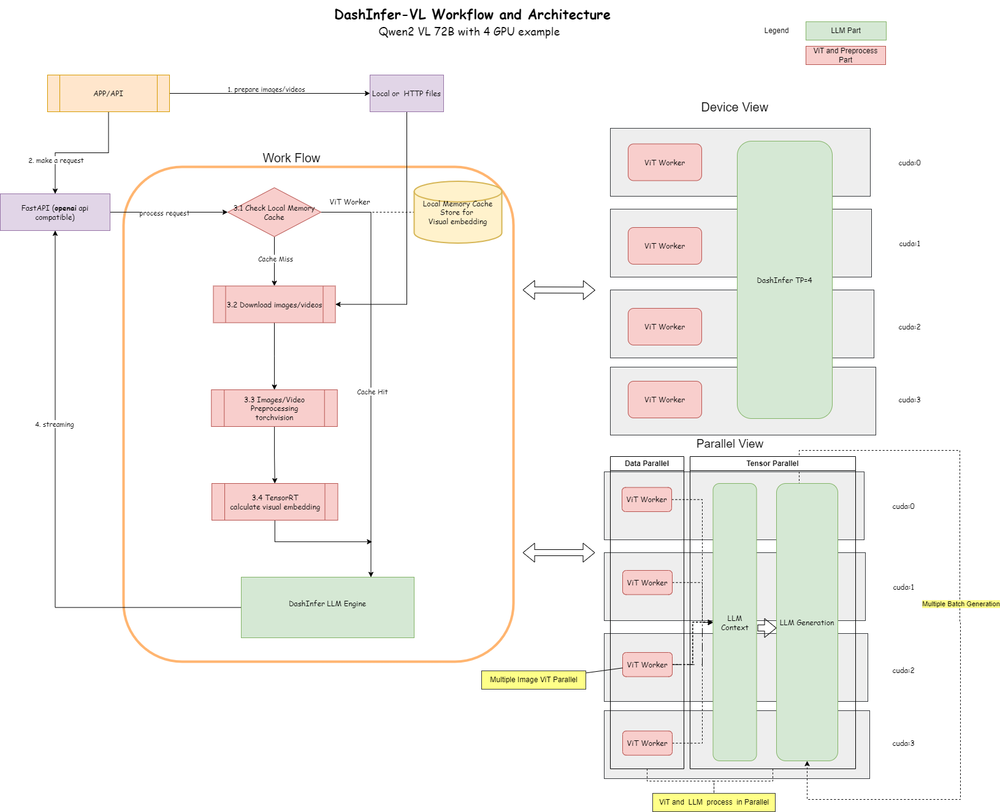

# DashInfer VLMs Toolkit

DashInfer VLMs is a toolkit to support Vision Language Models (VLMs) inference based on the DashInfer engine. It's compatible with the OpenAI Chat Completion API, supporting text and image/video inputs.

## Table of Contents
- [Architecture](#architecture)
- [API Reference](#api-reference)

## Supported Models
- Qwen2-VL 2B/7B/72B

## Architecture

## API Reference
Currently, some [openai chat completion API](https://platform.openai.com/docs/api-reference/chat) parameters are unavailable. Here are the list of supported parameters in dashinfer vlm.

### Request Body
| Parameters        | Type     | Required | Default | Description |
| :---------------- | :------: | :----: | :------: | :---- |
| messages        |   array   | True | -   | See [System message](#system-message), [User message](#user-message), [Assistant message](#assistant-message) |
| model           |   string   | False | model   | Since only supports a single model service, there's no need to specify a particular model name.  |
| stream    |  boolean or null   | False | False   | If true, returns a stream of events that happen during the Run as server-sent events, terminating when the Run enters a terminal state with a data: [DONE] message. |
| frequency_penalty |  number or null   | False | 0   | Number between -2.0 and 2.0. Positive values penalize new tokens based on their existing frequency in the text so far, decreasing the model's likelihood to repeat the same line verbatim. |
| max_completion_tokens    |  integer or null   | False | 4096   | The maximum number of total generated tokens that not include prompt. This value can be used to control costs for text generated via API. |
| n    |  integer or null   | False | 1   | Only support n=1. |
| temperature  |  number or null   | False | 1   | What sampling temperature to use, between 0 and 2. Higher values like 0.8 will make the output more random, while lower values like 0.2 will make it more focused and deterministic. We generally recommend altering this or top_p but not both. |
| top_p  |  number or null   | False | 1   | An alternative to sampling with temperature, called nucleus sampling, where the model considers the results of the tokens with top_p probability mass. So 0.1 means only the tokens comprising the top 10% probability mass are considered. |

### System message
| Parameters        | Type     | Required | Default | Description |
| :---------------- | :------: | :----:   | :------:| :----       |
| content           |   array  | True     | -       | See [Content](#content) |
| role              |   string | True     | -       | The role of the messages author. Always `system`.  |

### User message
| Parameters        | Type     | Required | Default  | Description |
| :---------------- | :------: | :----:   | :------: | :----       |
| content           |   array  | True     | -        | See [Content](#content) |
| role              |   string | True     | -        | The role of the messages author. Always `user`.  |

### Assistant message
| Parameters        | Type     | Required | Default | Description |
| :---------------- | :------: | :----: | :------: | :---- |
| content        |   array   | True | -   | See [Content](#content) |
| role           |   string   | True | -   | The role of the messages author. Always `assistent`.  |

### Content
An array of content parts with a defined type. Can contain text, image, or vedio inputs.

#### Text content part
| Parameters        | Type     | Required | Default | Description |
| :---------------- | :------: | :----:   | :------:| :---- |
| type           |   string  | True     | -       | The type of the content part. Always `text`.  |
| text            |   string   | True | -   | The text content.  |

#### Image content part
| Parameters        | Type     | Required | Default | Description |
| :---------------- | :------: | :----:   | :------:| :---- |
| type           |   string  | True     | -       | The type of the content part. Always `image_url`.  |
| image_url      |   object   | True | -   | see [Image URL](#image-url)  |

#### Video content part
| Parameters        | Type     | Required | Default | Description |
| :---------------- | :------: | :----:   | :------:| :---- |
| type           |   string  | True     | -       | The type of the content part. Always `video_url`.  |
| video_url      |   object   | True | -   | see [Video URL](#video-url)  |

### Image URL
| Parameters        | Type     | Required | Default | Description |
| :---------------- | :------: | :----:   | :------:| :---- |
| url           |   string  | True     | -       | Either a URL of the image or the base64 encoded image data.  |
| min_pixel     |   integer | False    | 4\*28*28   | A lower bound for the total number of pixels    |
| max_pixel	    |   integer	| False	   | 1280\*28\*28	     | An upper bound for total number of pixels |

### Video URL
| Parameters        | Type     | Required | Default | Description |
| :---------------- | :------: | :----:   | :------:| :---- |
| url               |   string or array  | True     | -       | If it's a string, it represents a URL of the video. If it's an array, it contains decoded image URLs or base64-encoded image data.  |
| fps               |   integer | False    | None   | necessary if url is a video file   |

### Chat Completion
Represents a chat completion response returned by model, based on the provided input.
| Parameters        | Type     | Description |
| :---------------- | :------: |  :---- |
| id               |   string  | A unique identifier for the chat completion. |
| choices          |   array  | See [Choices](#choices) |
| model               |   string  | The model used for the chat completion. |
| usage               |   object  | See [Usage](#usage) |

### Choices
A list of chat completion choices. Can be more than one if n is greater than 1.
| Parameters        | Type     | Description |
| :---------------- | :------: |  :----      |
| finish_reason     |  string  | The reason the model stopped generating tokens. This will be `stop` if the model hit a natural stop point or a provided stop sequence, `length` if the maximum number of tokens specified in the request was reached. |
| index     |  integer  | The index of the choice in the list of choices. |
| message   |  string or null  | See [Messege](#message) |
| logprobs  |  object or null  | Log probability information for the choice. |

### Usage
Usage statistics for the completion request.
| Parameters        | Type     | Description |
| :---------------- | :------: |  :----      |
| completion_tokens |  integer  | Number of tokens in the generated completion. |
| prompt_tokens     |  integer  | Number of tokens in the prompt. |
| total_tokens      |  integer   | Total number of tokens used in the request (prompt + completion). |

### Messege
A chat completion message generated by the model.
| Parameters        | Type     | Description |
| :---------------- | :------: |  :----      |
| content |  string or null  | The contents of the message. |
| role |  string  | The role of the author of this message. |

